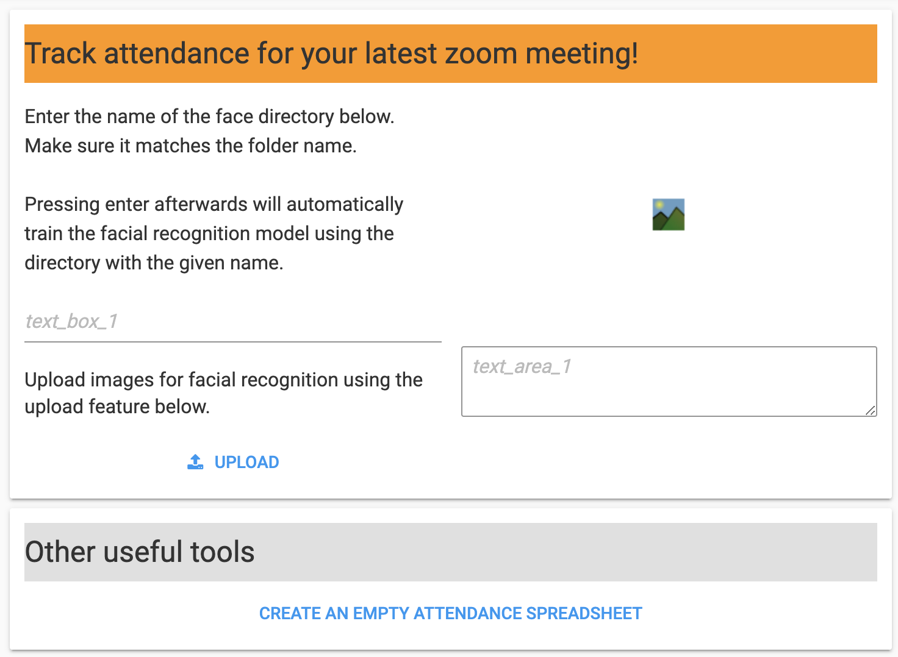

# ZoomFacialRecognition
Built a tool to help instructors keep track of virtual classroom attendance using a python facial_recognition library. Used Anvil to create a simple user interface by connecting it to the code in the Jupyter Notebook.
The user first uploads a training sample filled with images of each student in the class. Once the model is trained, the user can upload a screenshot of the Zoom meeting and will get a csv file with a list of names and if they are present or not.
## Anvil User Interface

